# 🛡️ Intelligent Cybersecurity Threat Intelligence Platform

## 📋 Table of Contents
- [Overview](#overview)
- [Screenshots Gallery](#screenshots-gallery)
- [Problem Statement](#problem-statement)
- [Solution Architecture](#solution-architecture)
- [Features](#features)
- [Technology Stack](#technology-stack)
- [Project Structure](#project-structure)
- [Installation & Setup](#installation--setup)
- [Usage](#usage)
- [API Endpoints](#api-endpoints)
- [Workflow Details](#workflow-details)
- [Configuration](#configuration)
- [Contributing](#contributing)

## 🎯 Overview

This project implements a comprehensive **Intelligent Cybersecurity Threat Intelligence Platform** designed to automate the collection, analysis, and dissemination of cybersecurity threats from multiple sources. The platform leverages AI/LLM capabilities for intelligent threat analysis and provides automated reporting to security teams.

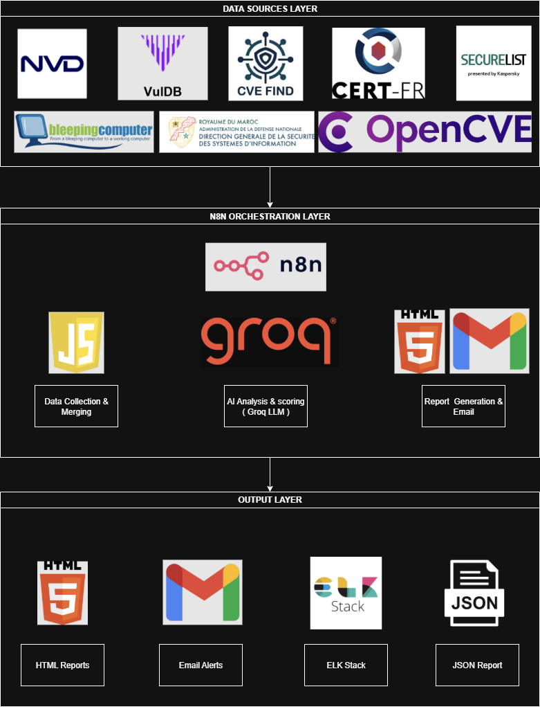

## 📸 Screenshots Gallery

### 🎛️ N8N Workflow Dashboard
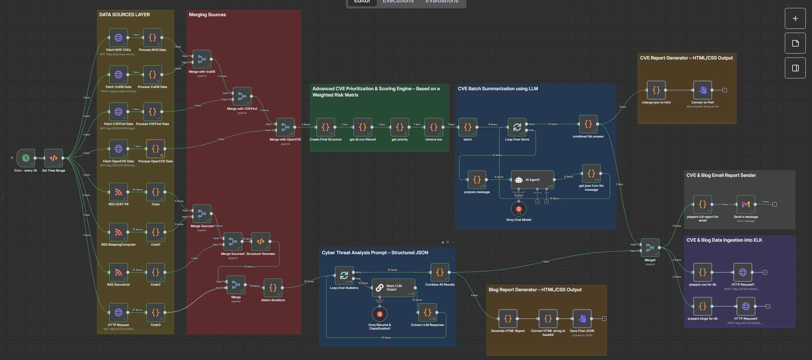
*Complete N8N workflow showing all data collection, processing, and reporting nodes*

### 📊 Executive Threat Dashboard
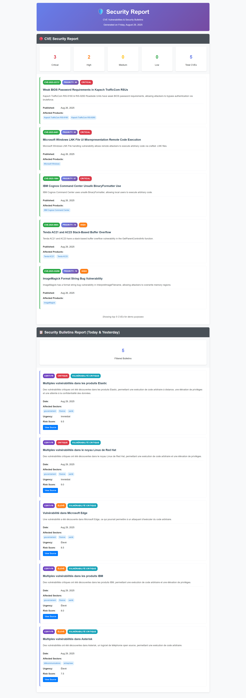
*HTML report showing threat statistics, CVE priorities, and security bulletins*

### 🔍 CVE Analysis Report
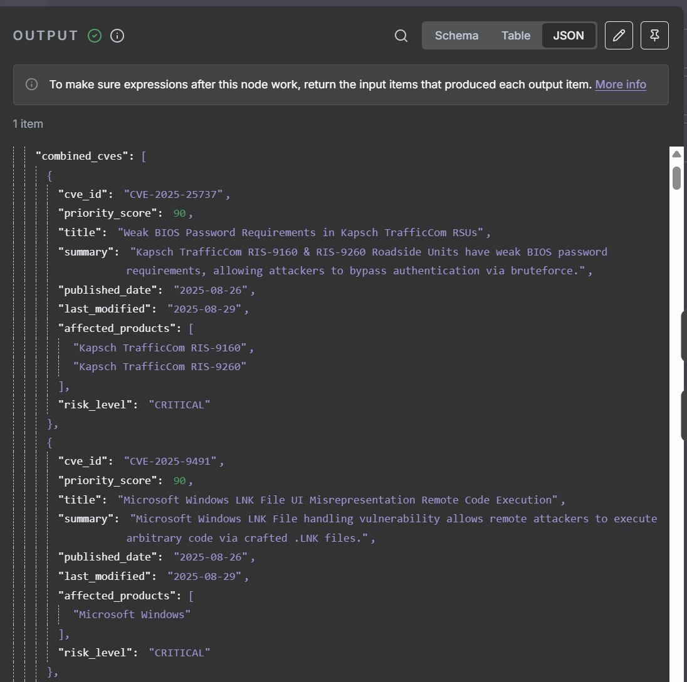
*Detailed CVE analysis with AI-generated summaries and priority scoring*

### 📧 Email Notifications
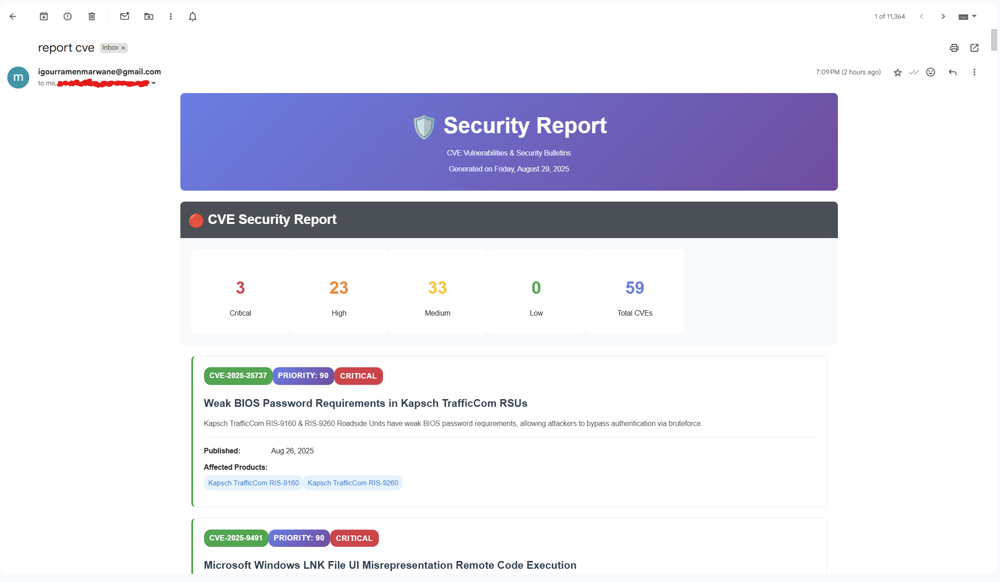
*Automated email reports sent to security teams with threat intelligence*

### 🖥️ Kibana Analytics
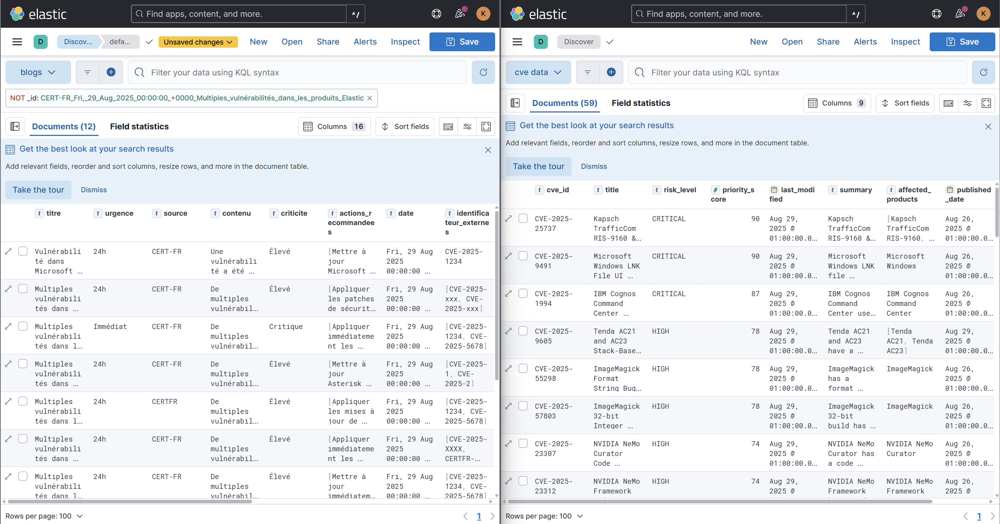
*ELK Stack visualization showing threat trends and analytics*


## 🚨 Problem Statement

### Context and Challenges

Security teams face an overwhelming volume of threat information from multiple sources:
- **CVE databases** (NVD, VulDB, CVEFind, OpenCVE)
- **Security bulletins** (CERT-FR, DGSSI Morocco)
- **Threat intelligence feeds** (RSS, blogs, forums)
- **Regional alerts** (FR-CERT, DGSSI)

This information overload results in:
- ⚠️ **Analyst fatigue** from manual threat triage
- ⏰ **Time waste** sorting through irrelevant information
- 🔗 **Lack of contextualization** with internal events (SIEM)
- 🐌 **Delayed response** to real threats

## 🏗️ Solution Architecture

### Core Objectives

1. **Automated Threat Collection**
   - Structured sources (APIs: NVD, VulDB, CERT-FR)
   - Unstructured sources (Web scraping: RSS, blogs, forums)

2. **Intelligent Priority Scoring**
   - Technology stack relevance (Fortinet, Microsoft, VMware)
   - Geographic targeting (Morocco, EMEA)
   - Client sector focus (Banking, Public sector)

3. **AI-Powered Analysis**
   - LLM-based threat summarization (Groq, OpenAI)
   - Automated threat classification
   - Risk level assessment

4. **SIEM Integration**
   - Automatic IOC injection into Wazuh/ELK
   - Log correlation with internal events
   - Real-time alerting

5. **Automated Reporting**
   - Daily/weekly executive reports
   - Multi-format output (HTML, PDF, Email)
   - Stakeholder notifications

## ✨ Features

### 🔄 Automated Data Collection
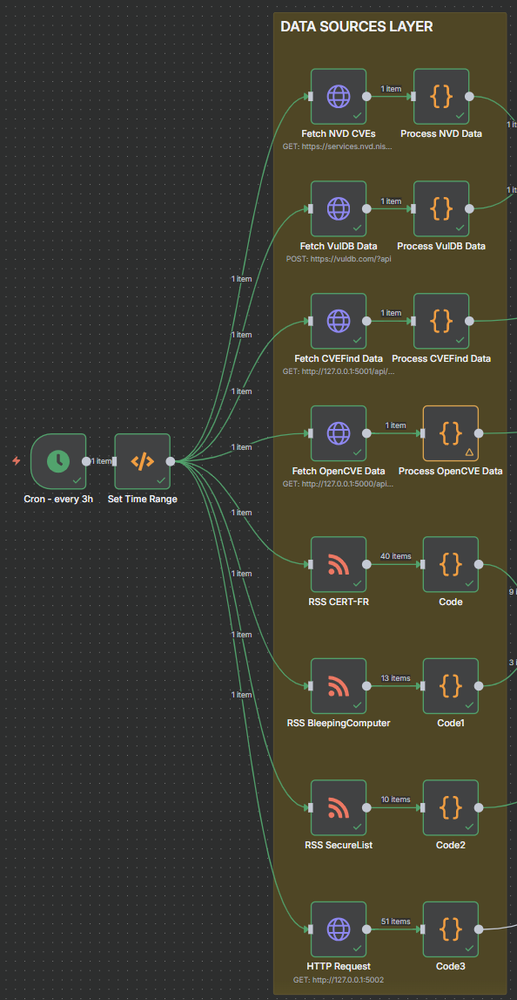
- **Multi-source CVE aggregation** from NVD, VulDB, CVEFind, OpenCVE
- **Security bulletin scraping** from CERT-FR and DGSSI Morocco
- **RSS feed monitoring** from security blogs and forums
- **Real-time threat intelligence** gathering

### 🧠 AI-Powered Analysis
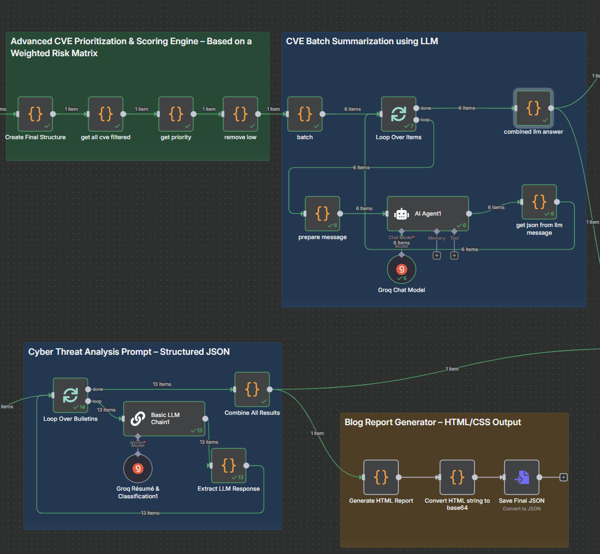
- **LLM-based threat summarization** using Groq API
  - Model: `meta-llama/llama-4-scout-17b-16e-instruct` (Meta Llama 4 Scout)
  - High-performance inference for real-time threat analysis
- **Custom priority scoring** based on organizational context
- **Automated threat classification** and risk assessment
- **Intelligent deduplication** and correlation

### 📊 Advanced Reporting

- **Executive dashboard** with threat overview
- **Detailed CVE reports** with priority scoring
- **Security bulletin summaries** with risk levels
- **Automated email notifications** to security teams

### 🔧 Integration Capabilities
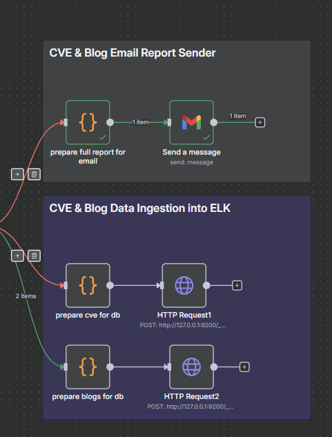
- **ELK Stack integration** for log analysis and visualization
- **SIEM compatibility** for threat correlation
- **Email automation** via Gmail API

## 🛠️ Technology Stack

### Orchestration & Workflow
- **N8N** - Workflow automation and orchestration
- **Docker Compose** - Container orchestration for ELK stack

### Data Collection & Processing
- **Python 3.8+** - Core scraping and processing logic
- **Flask** - REST API servers for data endpoints
- **BeautifulSoup4** - Web scraping and HTML parsing
- **Requests** - HTTP client for API interactions

### AI & Machine Learning
- **Groq API** - LLM for threat analysis and summarization
  - Model: `meta-llama/llama-4-scout-17b-16e-instruct`
- **LangChain** - AI workflow orchestration
- **OpenAI API** - Alternative LLM provider

### Data Storage & Analysis
- **Elasticsearch** - Search and analytics engine
- **Kibana** - Data visualization and dashboards

### Communication & Reporting
- **Gmail API** - Automated email notifications
- **HTML/CSS** - Rich report formatting

## 📁 Project Structure


```
cybersecurity-intelligence-platform/
├── 📄 README.md                    # This file
├── 📄 exemple rapport.html        # exemple report
├── 🐳 docker-compose.yml          # ELK Stack configuration
├── 🔄 My workflow.json            # N8N workflow definition
├── 🚀 start_all_servers.bat       # Server startup script
├── 📸 screenshots/                # Documentation screenshots
│   ├── platform-overview.png
│   ├── n8n-workflow-overview.png
│   ├── executive-dashboard.png
│   └── ... (other screenshots)
│
├── 🌐 cvefind.com/                # CVEFind.com scraper
│   ├── cvefind_server.py          # Flask server for CVEFind API
│   └── requirements.txt           # Python dependencies
│
├── 🇲🇦 dgssi/                     # DGSSI Morocco scraper
│   ├── dgssi_scraper.py           # Flask server for DGSSI bulletins
│   └── requirements.txt           # Python dependencies
│
└── 🔍 opencve.io/                 # OpenCVE scraper
    ├── simple_cve_server.py       # Flask server for OpenCVE API
    └── requirements.txt            # Python dependencies
```

## 🚀 Installation & Setup

### Prerequisites
- **Python 3.8+**
- **Docker & Docker Compose**
- **N8N** (self-hosted or cloud)
- **Git**

### 1. Clone Repository
```bash
git clone <repository-url>
cd cybersecurity-intelligence-platform-n8n
```

### 2. Start ELK Stack
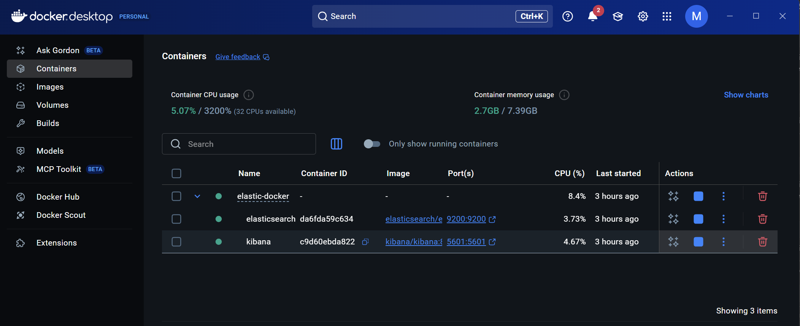
```bash
# Start Elasticsearch, Kibana, and Logstash
docker-compose up -d

# Verify services are running
docker-compose ps
```

### 3. Install Python Dependencies
```bash
# Install dependencies for all scrapers
cd cvefind.com && pip install -r requirements.txt && cd ..
cd dgssi && pip install -r requirements.txt && cd ..
cd opencve.io && pip install -r requirements.txt && cd ..
```

### 4. Start Scraper Services
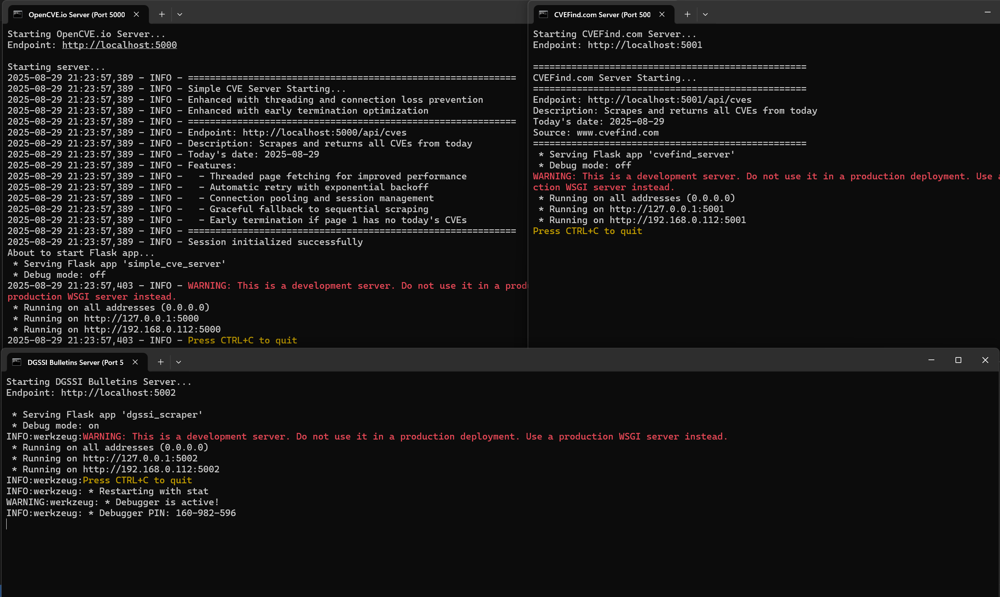
```bash
# Use the automated startup script
./start_all_servers.bat

# Or start manually:
# Terminal 1: python cvefind.com/cvefind_server.py
# Terminal 2: python dgssi/dgssi_scraper.py
# Terminal 3: python opencve.io/simple_cve_server.py
```

### 5. Import N8N Workflow
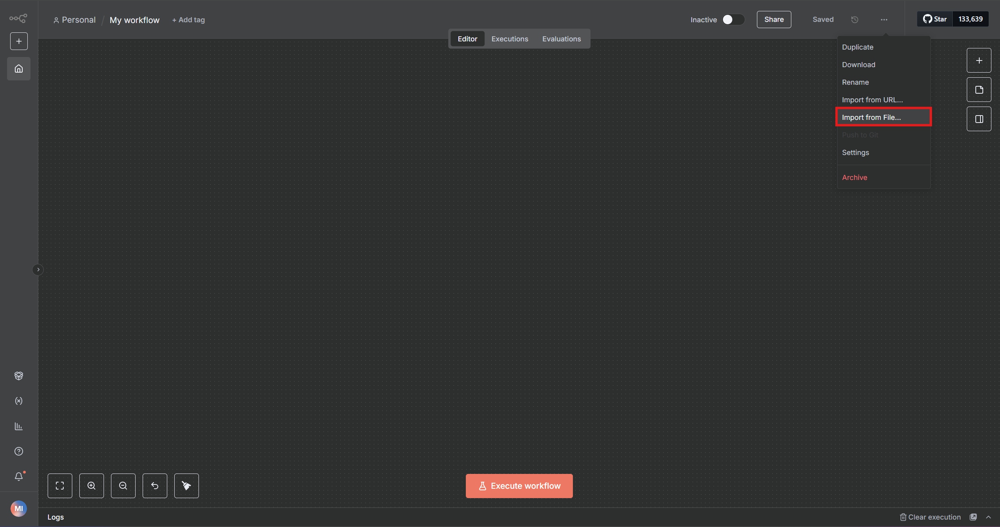
1. Open N8N interface
2. Import `My workflow.json`
3. Configure credentials (Gmail, Groq API)
4. Activate workflow

## 🎮 Usage

### Manual Execution
1. **Trigger workflow** manually in N8N interface
2. **Monitor execution** in N8N logs
3. **Check email** for automated reports
4. **View dashboards** in Kibana (http://localhost:5601)

### Automated Execution
- **Cron schedule**: Every 3 hours (configurable in N8N)
- **Automatic email reports** sent to security team
- **SIEM integration** for real-time alerting

### Accessing Services
- **Kibana Dashboard**: http://localhost:5601
- **Elasticsearch**: http://localhost:9200
- **CVEFind API**: http://localhost:5001/api/cves
- **DGSSI API**: http://localhost:5002/api/bulletins
- **OpenCVE API**: http://localhost:5000/api/cves

## 🔌 API Endpoints

### CVEFind Server (Port 5001)
```http
GET /api/cves              # Get today's CVEs from CVEFind.com
GET /                      # Server status and information
GET /api/test-csrf         # Test CSRF token extraction
```

### DGSSI Server (Port 5002)  
```http
GET /                      # Get all DGSSI security bulletins
GET /health                # Health check endpoint
```

### OpenCVE Server (Port 5000)
```http
GET /api/cves              # Get today's CVEs from OpenCVE.io
GET /                      # Server status and information
```

## 🔄 Workflow Details

### N8N Workflow Components

#### 1. **Data Collection Phase**
- **Manual/Cron Trigger** → Initiates the workflow
- **Time Range Setup** → Defines collection timeframe (last 3 hours)
- **Parallel Data Fetching**:
  - NVD CVE API (https://services.nvd.nist.gov/rest/json/cves/2.0)
  - VulDB API (https://vuldb.com/?api)
  - CVEFind Local Server (http://127.0.0.1:5001/api/cves)
  - OpenCVE Local Server (http://127.0.0.1:5000/api/cves)
  - CERT-FR RSS Feed (https://www.cert.ssi.gouv.fr/feed/)
  - Security Blog RSS Feeds (BleepingComputer, SecureList)
  - DGSSI Bulletins (http://127.0.0.1:5002/)

#### 2. **Data Processing Phase**
- **Data Normalization** → Standardize formats across sources
- **Merge Operations** → Combine data from multiple sources
- **CVE Filtering** → Remove duplicates and apply relevance filters
- **Priority Scoring** → Custom scoring based on:
  - Technology stack relevance
  - Geographic impact (Morocco, EMEA)
  - Sector-specific risks (Banking, Public)
  - CVSS scores and exploit availability

#### 3. **AI Analysis Phase**
- **Batch Processing** → Split large datasets for efficient processing
- **LLM Integration** → Groq API with `meta-llama/llama-4-scout-17b-16e-instruct`
- **Intelligent Summarization** → Generate concise threat descriptions
- **Risk Classification** → Automated priority level assignment
- **JSON Extraction** → Parse LLM responses into structured data

#### 4. **Report Generation Phase**
- **HTML Report Creation** → Rich, interactive threat dashboard
- **Email Preparation** → Format reports for email distribution
- **Multi-format Output** → HTML, PDF, and JSON formats
- **Stakeholder Notification** → Automated email to security teams

#### 5. **Integration Phase**
- **SIEM Data Preparation** → Format for Elasticsearch ingestion
- **Database Storage** → Store processed threats for historical analysis
- **Webhook Notifications** → External system integrations

### Key Workflow Features

#### 🔄 **Automated Scheduling**
- **Cron Trigger**: Runs every 3 hours automatically
- **Manual Override**: Can be triggered manually for immediate updates
- **Error Handling**: Robust error recovery and logging

#### 🧠 **AI-Powered Processing**
- **Groq LLM Integration**: Advanced threat analysis and summarization
- **Custom Prompts**: Tailored for cybersecurity context
- **Batch Processing**: Efficient handling of large CVE datasets
- **JSON Parsing**: Structured output extraction from LLM responses

#### 📊 **Advanced Reporting**
- **Executive Dashboard**: High-level threat overview with statistics
- **Detailed CVE Cards**: Individual threat analysis with priority scores
- **Security Bulletin Integration**: DGSSI and CERT-FR alerts
- **Multi-channel Distribution**: Email, dashboard, and API endpoints

#### 🔗 **Integration Capabilities**
- **ELK Stack**: Elasticsearch ingestion for advanced analytics
- **Gmail API**: Automated email notifications with attachments
- **Webhook Support**: External system notifications
- **REST APIs**: Programmatic access to threat data

## ⚙️ Configuration

### Environment Variables
```bash
# API Keys
GROQ_API_KEY=your_groq_api_key_here
VULDB_API_KEY=your_vuldb_api_key_here

# Email Configuration
GMAIL_CLIENT_ID=your_gmail_client_id
GMAIL_CLIENT_SECRET=your_gmail_client_secret

# ELK Stack Configuration
ELASTIC_PASSWORD=your_elasticsearch_password
KIBANA_PASSWORD=your_kibana_password
LOGSTASH_PASSWORD=your_logstash_password
```

### N8N Workflow Configuration
1. **Groq API Credentials**: Configure in N8N credentials manager
2. **Gmail OAuth2**: Set up Gmail API access for email notifications
3. **Webhook URLs**: Configure external integration endpoints
4. **Cron Schedule**: Adjust execution frequency (default: every 3 hours)

### Custom Priority Scoring
Edit the priority scoring logic in the N8N workflow:
```javascript
// Custom priority scoring based on organizational context
const priorityFactors = {
  technologies: ['Microsoft', 'VMware', 'Fortinet', 'Cisco'],
  sectors: ['Banking', 'Government', 'Healthcare'],
  regions: ['Morocco', 'EMEA', 'France'],
  cvssThreshold: 7.0
};
```

### Email Recipients
Configure email distribution lists in the Gmail node:
```javascript
{
  "to": "security-team@company.com",
  "cc": ["ciso@company.com", "soc@company.com"],
  "subject": "Daily Cybersecurity Threat Intelligence Report"
}
```

## 🤝 Contributing

### Development Setup
1. **Fork the repository**
2. **Create feature branch**: `git checkout -b feature/new-feature`
3. **Install development dependencies**: `pip install -r requirements-dev.txt`
4. **Run tests**: `python -m pytest tests/`
5. **Submit pull request**

### Adding New Data Sources
1. **Create new scraper** in dedicated directory
2. **Implement Flask API** following existing patterns
3. **Add to N8N workflow** as new HTTP request node
4. **Update documentation** and configuration

### Extending AI Analysis
1. **Modify LLM prompts** in N8N workflow
2. **Add new analysis models** (sentiment, classification)
3. **Implement custom scoring algorithms**
4. **Test with sample data**

## 📄 License

This project is licensed under the MIT License - see the [LICENSE](LICENSE) file for details.

## 🙏 Acknowledgments

- **DGSSI Morocco** for security bulletin data
- **CERT-FR** for French cybersecurity alerts
- **NVD/NIST** for comprehensive CVE database
- **Groq** for AI/LLM capabilities
- **N8N Community** for workflow automation platform

---

**🔒 Built with security in mind for security professionals**

For questions, issues, or contributions, please open an issue on GitHub or contact the development team.
